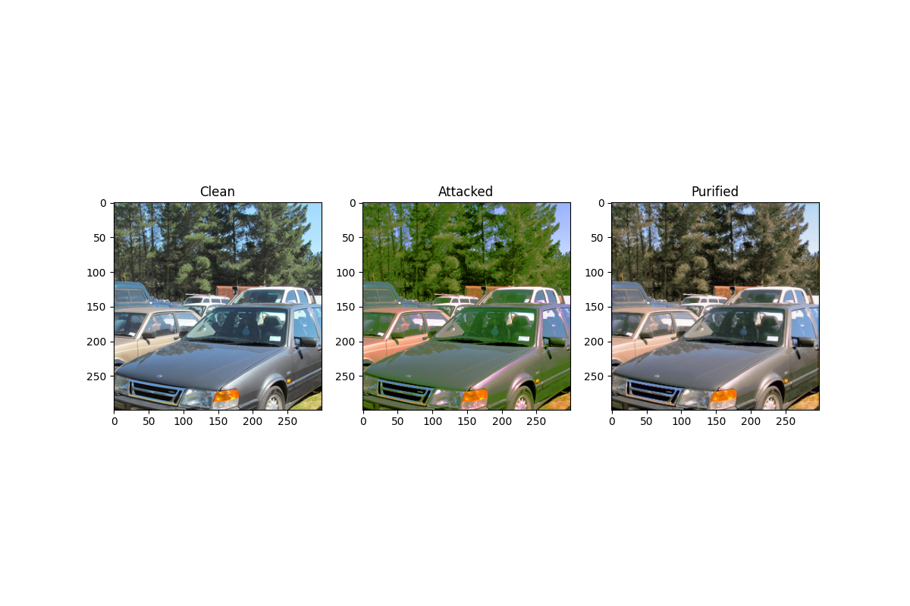

# Adversarial purification for IQA models


*Adversarial purification with FCNet against AdvCF attack*

### Install Requirements
1. Install [PDM](https://pdm.fming.dev/latest/)
2. Create and activate virtualenv 
3. Run ```pdm install``` in the root of the repo

### Download Datasets
1. Download [dataset](https://drive.google.com/drive/folders/1UHfXVdU5Ijy4P81wBqmaM2S-iv_C_QpA)
2. Unzip data:
```
upzip your_downloaded_path/dataset.zip
# your_downloaded_path is your path to the downloaded data
```

### Download checkpoints
Place the following checkpoints in `adversarial-purification/checkpoints`
1. [Linearity metric weights](https://titan.gml-team.ru:5003/fsdownload/Qo9PsqxNk/p1q2.pth)
2. [Pretrained FCN model for purification](https://drive.google.com/drive/folders/1c6hC5cSfeNfi5-jMHwsyZqoH_QXURmB_?usp=sharing)

### Run test defenses
```
cd adversarial-purification/adversarial_purification
python3 test.py \
    --reference-dir <path to source images> \
    --data-dir <path to attacked images> \
    --metric-checkpoints ../checkpoints \
    --defense <defense_method>
    --device=<device>
```

### Available defense methods
- Flip -- flip
- Random Crop -- random_crop
- Median Filter -- median_filter
- Gaussian Blur -- gaussian_blur
- Rotate -- rotate
- Resize -- upscale_nearest, upscale_bicubic, upscale_bilinear
- JPEG -- jpeg
- FCNet -- fcn_filter

### Results
Results plots are available in `adversarial-purification/plots`
